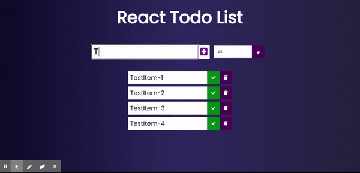

# To-Do List with React
This is the simple to-do List app with React.js.

> You can add tasks and delete
> You can mark the tasks as "completed" or "uncompleted"
> You can list the marked tasks
> You can use this page with localStorage.

You can just simply clone this repository any folder you want and open your favourite Terminal and simply run these commands.And you good to go :)

```sh
$ cd to-do-list
$ npm start
```

You can find the demo of this page down below : 




